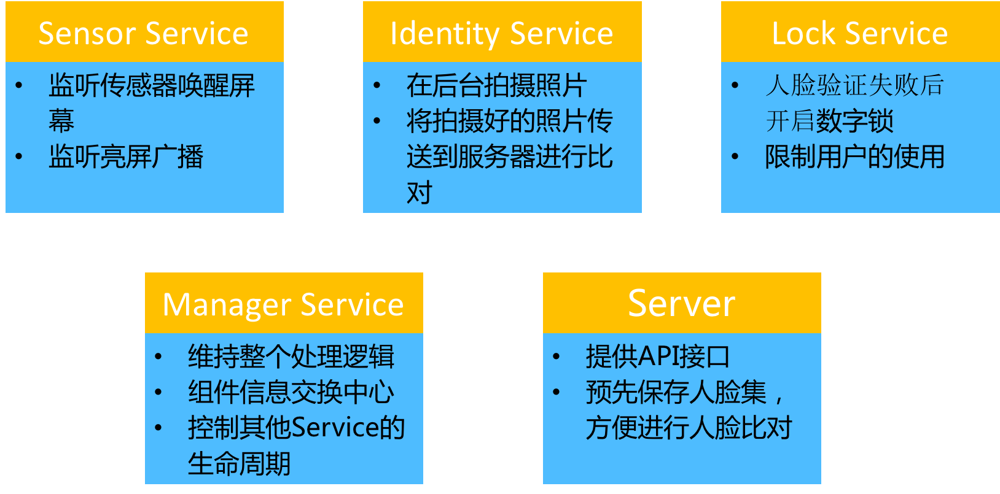
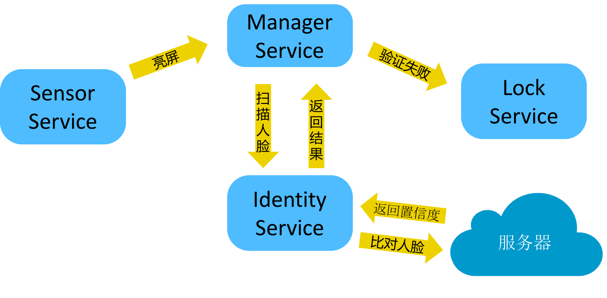
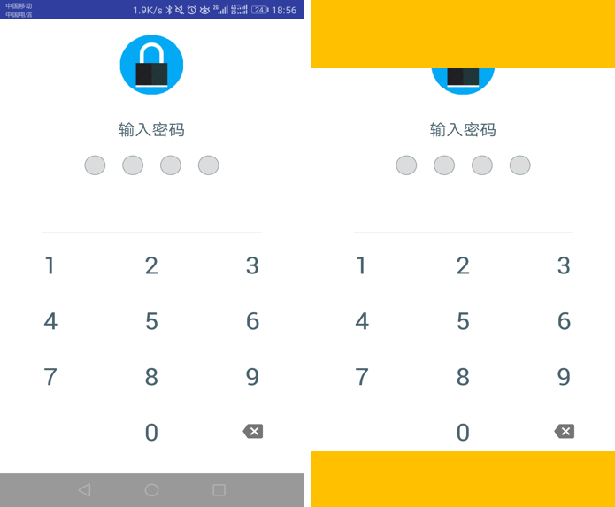

Open For You
==============

## 前言
此项目为移动互联网课程项目，旨在打造一款基于人脸识别的智能解锁软件，实现语言是Java，人脸处理使用到了 Face++ 提供的API接口，后期也实现了自己的API接口，详情移步至[myAPI](https://github.com/hzshang/FaceUnlock/tree/myAPI)分支，运行环境为Android 7.0。

## 项目概述
由于本身就是一款解锁软件，为避免用户二次解锁，系统本身的锁屏就不该使用，随之而来的就是安全性问题。如何能够在系统运行中将非机主用户拒之门外，是我们着力解决的问题。同时，解锁软件对实时性的要求必须足够高，减少用户人脸验证等待时间，提升用户体验，也是一大难题。

## 服务组件
项目主体为五大服务组件  

## 主要问题及解决思路
### 人脸验证  
为解决人脸验证的耗时长问题，我们主要采取先解锁，后验证的机制。手机亮屏后，用户可以直接使用，软件不会妨碍用户操作；同时，软件会才后台拍摄人脸照片，传送到服务器和预先采样的人脸集进行比对，如果比对失败，服务将直接调用自己的锁屏功能，用户此时需要自行输入密码，才能继续使用手机。  

### 锁屏实现
由于安卓并没有提供接管系统解锁的API，那我们只能采用曲线救国的策略，将用户限制在自己的Activity内。查看网上的方法，大多数都是基于绑定系统按键，使得手机按键实效的方法。但是为了安全行考虑，Android 7.0 系统弃用了此功能，不再提供绑定Home键的接口。  

本次实现中，主要采用了悬浮窗覆盖的方法，如下图所示  

  

用户看到的是解锁界面如左边所示，但实际上屏幕的顶部和底部分别加了两个透明的顶层悬浮窗，这时用户既无法使用下拉栏，也无法按到Home键，只能输入密码解锁手机。同时，为了保证设备的安全，一旦用户输入密码超过三次，系统就会直接锁屏，不再接受输入，用户等第二次打开手机时，将直接跳过人脸验证部分，直接进入解锁界面。  

### 进程保活
为了使服务能持久化运行，将系统服务设为前台服务，缺点就是必须有一个状态栏图标。将 Activity 的 excludeFromRecents 属性设为true，软件退出后不会保存在最近使用的应用列表，防止用户强杀服务。

## 技术清单  
### 客户端
#### [LolliPin](https://github.com/omadahealth/LolliPin)
提供最基本的锁屏UI和数字锁密码验证逻辑，实现时只需复写验证成功获失败的回调函数即可。  

#### [EventBus](https://github.com/greenrobot/EventBus)
一款实现非常简单的Android组件通信库，比原生的广播机制效率更高。  

### 服务端
#### [Face++ SDK](https://www.faceplusplus.com.cn/)
提供人脸检测、人脸比对、创建人脸集接口，需联网进行调用。

#### [Face_Recognition](https://github.com/ageitgey/face_recognition)
自己实现API接口时使用的人脸检测、识别库。

#### [Python Flask](https://github.com/pallets/flask)
自己实现API接口时使用的HTTP框架。

## 传送门
项目代码说明请参考 [代码说明.md](doc/代码说明.md)  
项目运行说明请参考 [运行说明.md](doc/运行说明.md)
